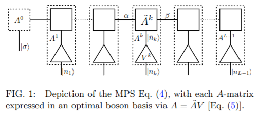

# OBB-VMPS

<p align="center">
  
  
</p>

This repository contains a MATLAB/Octave implementation of the **optimized-boson-basis variational matrix product state** method (**OBB-VMPS**) on a **Wilson chain**, as used in our paper *Critical and strong-coupling phases in one- and two-bath spin-boson models*, Phys. Rev. Lett. 108, 160401 (2012).

The core idea is to variationally compute the **ground state** of a discretized spin-boson Hamiltonian using an MPS, while controlling bosonic Hilbert-space truncation errors by (i) **optimizing a local boson basis** (OBB) on each site and (ii) optionally using an explicit **shifted oscillator basis** to capture large displacements in localized regimes.

## Quickstart

**Requirements:** MATLAB or GNU Octave (no third-party toolboxes required beyond standard linear algebra and `eigs`).

Run a small SBM1 ground-state calculation in octave:

```bash
octave --eval "addpath(pwd); VMPS_SBM1(0,0,0.6,0.1,2,20,0)"
```

Run the (larger) example in matlab:

```matlab
addpath('.');
VMPS_SBM1(0,0,0.6,0.1,2,50,0);
```

From a shell with MATLAB:

```bash
matlab -nosplash -nodesktop -r "addpath('.'); VMPS_SBM1(0,0,0.6,0.1,2,50,0); quit"
```

**Outputs:** each run creates a parameter-named folder such as `s0.6alpha0.1hx0hz0p0/` and saves `results.mat` there (see `VMPS_SBM1.m`).

## What is implemented here

- **Implemented, user-facing entry point:** `VMPS_SBM1.m` runs a **single-bath spin-boson model** on a single Wilson chain (called `para.model='SpinBoson'` in the code).
- **OBB (optimized boson basis):** enabled by default (`para.useVmat=1`).
- **Explicit oscillator shifts:** enabled by default (`para.useshift=1`).


## Background: the spin-boson model (SBM1/SBM2)

The spin-boson family describes a two-level system (spin-1/2 with Pauli matrices `σx, σy, σz`) linearly coupled to one or more independent bosonic baths. A common continuum Hamiltonian form is:

```text
H = H_spin + H_bath + H_coupling
H_spin = - (hx/2) σx - (hy/2) σy - (hz/2) σz
H_bath = ∫_0^{ωc} dω  ω  b_ω† b_ω
H_coupling = (σi/2) ∫_0^{ωc} dω  g(ω) (b_ω + b_ω†)   ,  i ∈ {x,y,z}
```

The bath is fully characterized (in the continuum limit) by its **spectral density** `J(ω)`; for power-law baths:

```text
J(ω) ∝ ω^s   (0 < ω < ωc)
```

- `s < 1`: **sub-ohmic**
- `s = 1`: **ohmic**
- `s > 1`: **super-ohmic**

**SBM1 (one bath):** one bath couples to a single spin component (commonly written as coupling to `σz` in the literature; this repo’s SBM1 implementation uses coupling to `σx`, i.e. a rotated convention).

**SBM2 (two baths):** two independent baths couple to two non-commuting spin components (e.g. `σx` and `σy`). In the XY-symmetric case one typically has equal bath exponents and couplings.

The OBB-VMPS method is typically used to compute **ground-state properties** across phases (delocalized vs localized, critical points), including order parameters like `⟨σ⟩`, bosonic displacements `⟨x_k⟩`, and related observables.

## Method overview (high-level pipeline)

The repo follows the standard “bath → Wilson chain → (OBB-)VMPS” pipeline:

1. **Log-discretize** the bath spectral density on intervals set by Wilson parameter `Λ > 1` (optionally with a `z`-shift).
2. Build a **discrete star Hamiltonian** with oscillator energies `ξ_m` and couplings `γ_m`.
3. **Map star → Wilson chain** (tridiagonalization / Lanczos) to obtain on-site energies `ε_k` and hoppings `t_k`.
4. Solve the resulting **impurity + Wilson chain** Hamiltonian variationally using an **MPS** with one-site updates (“VMPS/DMRG-style sweeps”).
5. For each bosonic site, use an **optimized boson basis** `V_k` (OBB) and optionally an explicit **shift** to efficiently represent large displacements.


## Practical usage

### Entry point and arguments

The main driver is:

```matlab
VMPS_SBM1(hx, hz, s, alpha, Lambda, L, parity)
```

Defined in `VMPS_SBM1.m`. These are the **only** parameters exposed as function arguments:

- `hx`: spin field along `σx` in this repo’s convention (see `genh1h2term_onesite.m`)
- `hz`: spin field along `σz`
- `s`: bath power-law exponent used in `SBM_genpara.m`
- `alpha`: bath coupling strength used in `SBM_genpara.m`
- `Lambda`: Wilson discretization parameter `Λ > 1`
- `L`: total number of sites in the MPS **including the impurity spin** (so there are `L-1` boson sites)
- `parity`: integer selector:
  - `0` → `para.parity='n'` (no parity)
  - `1` → `para.parity='o'` (odd parity sector)
  - `2` → `para.parity='e'` (even parity sector)

Many important algorithmic parameters are **hard-coded defaults** inside `VMPS_SBM1.m` (bond dimensions, local boson cutoffs, tolerances, shift settings). See **Key parameters** below.

### Outputs and where they are saved

Each run creates a folder:

```text
s{para.s}alpha{para.alpha}hx{para.hx}hz{para.hz}p{parity}/results.mat
```

The saved MAT-file contains:

- `para`: parameter struct (includes `epsilon`, `t`, `dk`, `d_opt`, `D`, `shift`, tolerances, etc.)
- `mps`: cell array of MPS site tensors (each `mps{j}` is `D_left × D_right × d_opt(j)`)
- `Vmat`: cell array of OBB isometries (`Vmat{j}` is `dk(j) × d_opt(j)`)
- `op`: operator/Hamiltonian term storage used by the sweep
- `results`: collected diagnostics and measurements, including:
  - `results.E`: latest energy estimate from the local eigensolve
  - `results.Eerror`: sweep-to-sweep energy stability metric used as convergence test (`minimizeE.m`)
  - `results.Vmat_sv`, `results.Amat_sv`: stored singular values from OBB and MPS SVD steps
  - `results.spin`: spin expectations from `calspin.m`
  - `results.nx`: boson occupations from `calbosonocc_SBM1.m`
  - `results.bosonshift`: displacement diagnostics from `calbosonshift_SBM1.m` (see note below)

**Resume behavior:** if the folder already exists, `VMPS_SBM1.m` sets `para.resume=1` and will continue from the saved `results.mat` by default (see `loadsaved.m`). To force a fresh start, delete the output folder or set `para.resume=0` in `VMPS_SBM1.m`.

### Key parameters (defaults in `VMPS_SBM1.m`)

The driver sets a number of defaults; some of the most important ones are:

- **Local dimensions**
  - `para.dk_start = 100` and `para.dk = 100*ones(1,L)` with `para.dk(1)=2` (physical/local basis size per site)
  - `para.d_opt = 6*ones(1,L)` with `para.d_opt(1)=2` (optimized basis size per site)
- **Bond dimensions**
  - `para.D = 10*ones(1,L-1)` (initial MPS bond dimensions; `para.D(L)` unused)
- **Convergence / eigensolver**
  - `para.loopmax = 200` (max sweeps)
  - `para.precision = 5e-15` (convergence criterion uses `results.Eerror < precision`; see `minimizeE.m`)
  - `para.eigs_tol = 1e-8` (tolerance passed to `eigs` in `minimizeE_onesiteA.m` / `minimizeE_onesiteVmat.m`)
- **OBB truncation/expansion heuristics**
  - `para.svmaxtol = 1e-6`, `para.svmintol = 1e-8` (used by `adjustdopt.m`, `prepare_onesite_truncate.m`)
  - `para.dimlock = 0` (allow adaptive changes in `D` and `d_opt`; see `minimizeE.m`)
- **Shifts**
  - `para.useshift = 1` (enable)
  - `para.shift = zeros(1,L)` (initial)
  - `para.relativeshiftprecision = 0.01` (stop iterating a site when `|Δshift|/maxshift` is below this)
  - `para.maxshift = max eigenvalue of x in truncated basis` (computed by `maxshift.m`)


## Repository layout (files and roles)

All MATLAB/Octave source files live in the repo root. Key pieces:

```text
.
├── VMPS_SBM1.m                 # main entry point for SBM1 on a Wilson chain
├── SBM_genpara.m               # bath discretization + star parameters + chain mapping
├── star2tridiag.m              # Lanczos: star → tridiagonal (εk, tk)
├── extroplate.m                # extrapolate tiny tail chain parameters
├── genh1h2term.m               # build Hamiltonian term containers over sites
├── genh1h2term_onesite.m       # one-site Hamiltonian construction (SpinBoson + partial others)
├── minimizeE.m                 # main sweep loop (left→right optimization + right normalization)
├── optimizesite.m              # per-site OBB + MPS update + optional shift iteration
├── minimizeE_onesiteA.m        # local A update via eigs(@HmultA)
├── minimizeE_onesiteVmat.m     # local Vmat update via eigs(@HmultVmat)
├── HmultA.m                    # effective-Hamiltonian matvec for A
├── HmultVmat.m                 # effective-Hamiltonian matvec for Vmat
├── prepare.m                   # initial canonicalization of MPS + OBB prep
├── prepare_onesite.m           # SVD canonicalization (left/right)
├── prepare_onesiteAmat.m       # SVD step used before Vmat optimization
├── prepare_onesiteVmat.m       # SVD step used after Vmat optimization
├── rightnormA.m                # right-normalization pass between sweeps
├── update*.m / initstorage.m   # environment/operator storage updates for effective Hamiltonians
├── bosonop.m / spinop.m        # local operators (boson with optional shift; Pauli matrices)
├── expectation*.m              # generic expectation value contraction utilities
├── calspin.m                   # compute <σx>, <σy>, <σz>
├── calbosonocc_SBM1.m          # compute boson occupations <n_k>
├── calbosonshift_SBM1.m        # compute boson displacement diagnostics (see note below)
├── parity*.m                   # parity-sector support (optional)
├── 1110.6314v2.pdf             # Guo et al. preprint (reference)
└── clean_dir                   # cleanup script (removes outputs; use with care)
```


## References / citation

If you use this code in academic work, please cite:

```
@article{PhysRevLett.108.160401,
  title = {Critical and Strong-Coupling Phases in One- and Two-Bath Spin-Boson Models},
  author = {Guo, Cheng and Weichselbaum, Andreas and von Delft, Jan and Vojta, Matthias},
  journal = {Phys. Rev. Lett.},
  volume = {108},
  issue = {16},
  pages = {160401},
  numpages = {5},
  year = {2012},
  month = {Apr},
  publisher = {American Physical Society},
  doi = {10.1103/PhysRevLett.108.160401},
  url = {https://link.aps.org/doi/10.1103/PhysRevLett.108.160401}
}
```
